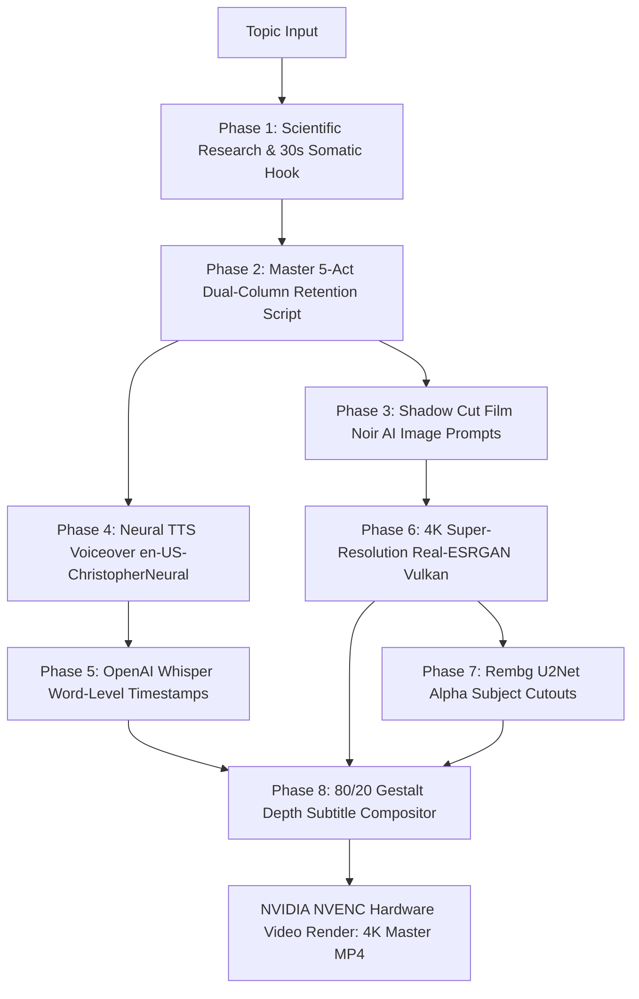

# 🎬 Cinematic Explainer Studio

> **Autonomous End-to-End Production Pipeline for High-Retention, 4K Faceless YouTube Explainer Videos (8–10 Minutes).**  
> *Developed for the psychology and science channel **Isy why** (`@isy019`).*

[](https://www.python.org/downloads/)
[]()
[]()
[]()

---

## 🏛️ System Architecture

The pipeline orchestrates viral psychology, dual-column retention scripting, 4K AI visual art direction, and a custom 3D depth compositing engine.



---

## ⭐️ Key Innovations

### 1. The 80/20 Gestalt Legibility Depth Rule
Subtitles tuck dynamically *behind* the character cutout to create cinematic 3D depth without sacrificing readability:
$$\text{occlusion} = \frac{\sum (\text{cutout\_alpha} > 128 \land \text{text\_mask})}{\sum \text{text\_mask}}$$
* **Occlusion $\le 20\%$:** Text is composited **behind the character cutout** (`Background → Text → Cutout`) for stunning spatial depth.
* **Occlusion $> 20\%$ (e.g. close-ups):** Text automatically elevates to the **foreground** (`Background → Cutout → Text`) to guarantee **100% legibility**.

### 2. Intelligent Placement Anchors
* **Bed / Lying Down Shots:** Subtitles anchor to the dark bedroom wall at `ty = 65` above the headboard with **zero text on duvets or blankets**.
* **Centered Character Shots:** Text shifts into the open **left-third negative space** (`tx = 120, ty = 230`, max-width: 780px).

### 3. Visual Cut Snapping (Zero Flash / Zero Repetition)
Prevents subtitles from flashing prematurely or duplicating across shot transitions:
* **Start Snapping:** Phrases starting within $0.35\text{s}$ before a shot transition snap directly to `cut_t`.
* **End Clamping:** Phrases ending within $0.20\text{s}$ after a shot transition clamp directly to `cut_t`.

---

## 📂 Repository Layout

```
cinematic-explainer-studio/
├── SKILL.md                                 # Antigravity & LLM agent skill definition
├── prompts/
│   ├── cinematic-explainer-channel-master-prompt-v12.md # Master Prompt V12 (Self-contained)
│   └── 3d-animated-channel-master-prompt-v11.md         # Reference prompt archive
├── pipeline/
│   ├── render_master_video.py               # GPU NVENC 4K compositor & depth subtitle engine
│   ├── export_master_audio.py               # Edge-TTS generator with synthetic pause injection
│   ├── align_whisper.py                     # Whisper millisecond word timestamp alignment
│   ├── run_batch_upscale_4k.py              # Real-ESRGAN Vulkan 4K batch upscaler
│   ├── extract_cutouts_rembg.py             # U2Net foreground alpha cutout extractor
│   ├── compute_shot_layouts.py              # Visual positioning classifier (bed, left, center)
│   └── detect_cuts.py                       # OpenCV sequential frame-difference shot detector
├── research/
│   └── topic_01_nocturnal_cringe.md         # Full scientific dossier (DMN, dACC, Spotlight Effect)
├── script/
│   ├── SCRIPT_MASTER.md                     # Dual-column director's script (Visual/SFX + VO)
│   └── teleprompter_clean.txt               # Spoken-word teleprompter voiceover
├── storyboard/
│   ├── STORYBOARD.md                        # 29-scene visual sequence blueprint
│   └── visual_assets_manifest.json          # Color hex tokens, typography, audio cue sheet
├── packaging/
│   └── titles_thumbnails_metadata.md        # High-CTR thumbnail prompts, titles, SEO tags
├── production/
│   └── hyperframes_config.json              # Motion design tokens & timing parameters
├── assets/
│   ├── all_timeline_shots.json              # Frame-accurate shot cut boundaries
│   ├── full_timeline_word_timestamps.json   # Word-level timestamp registry
│   ├── shot_layouts.json                    # Per-shot layout categories & anchors
│   ├── fonts/                               # Playfair Display editorial font assets
│   └── verification_frames/                 # Visual proof inspection frames
├── requirements.txt                         # Python dependencies
└── README.md                                # System documentation
```

---

## 🚀 Getting Started

### 1. Prerequisites
* **Python 3.10+**
* **FFmpeg** (with `h264_nvenc` support recommended for NVIDIA GPUs)
* **Real-ESRGAN NCNN Vulkan** binary (`realesrgan-ncnn-vulkan.exe`)

### 2. Installation
```bash
git clone https://github.com/Indresh-hl/cinematic-explainer-studio.git
cd cinematic-explainer-studio
pip install -r requirements.txt
```

### 3. Running the Pipeline

#### Step A: Generate Master Voiceover
```bash
python pipeline/export_master_audio.py
```
*Generates `assets/full_master_audio.m4a` using Edge-TTS `en-US-ChristopherNeural` at `-3%` rate and `-2Hz` pitch with synthetic acoustic pauses.*

#### Step B: Align Word Timestamps (Whisper)
```bash
python pipeline/align_whisper.py
```
*Outputs `assets/full_timeline_word_timestamps.json` with millisecond start/end timestamps for every word.*

#### Step C: 4K Super-Resolution Batch (Real-ESRGAN)
```bash
python pipeline/run_batch_upscale_4k.py
```
*Upscales raw images to pristine 4K UHD using local GPU Vulkan acceleration.*

#### Step D: Extract Subject Cutouts (`rembg`)
```bash
python pipeline/extract_cutouts_rembg.py
```
*Extracts transparent foreground cutouts with cached `u2net` sessions in ~0.38s per image.*

#### Step E: Render Master 4K Video (NVENC GPU)
```bash
python pipeline/render_master_video.py
```
*Composites background stills, 3D depth subtitles with active karaoke pop (*Playfair Display* lowercase italic, Butter Cream `#FFF2A8` + Sunglow Gold `#FFD166`), and character cutouts directly into NVIDIA NVENC at 48+ FPS.*

---

## 🎨 Visual Palette Tokens

| Token Name | Hex Code | Purpose |
| :--- | :--- | :--- |
| **Obsidian Void** | `#08090C` | Existential darkness, nocturnal isolation |
| **Midnight Indigo** | `#0F172A` | Room shadow fills, protagonist wardrobe |
| **Projector Amber** | `#FFB703` | 35mm slide projector beam, desk lamps |
| **Biosensor Cyan** | `#06B6D4` | Default Mode Network (DMN), fMRI neural maps |
| **Threat Crimson** | `#E63946` | Amygdala alarm, social death threat |
| **Growth Gold** | `#E0A96D` | Epiphany, morning dawn, psychological healing |

---

## 📄 License
MIT License. Free for commercial and non-commercial video production.
